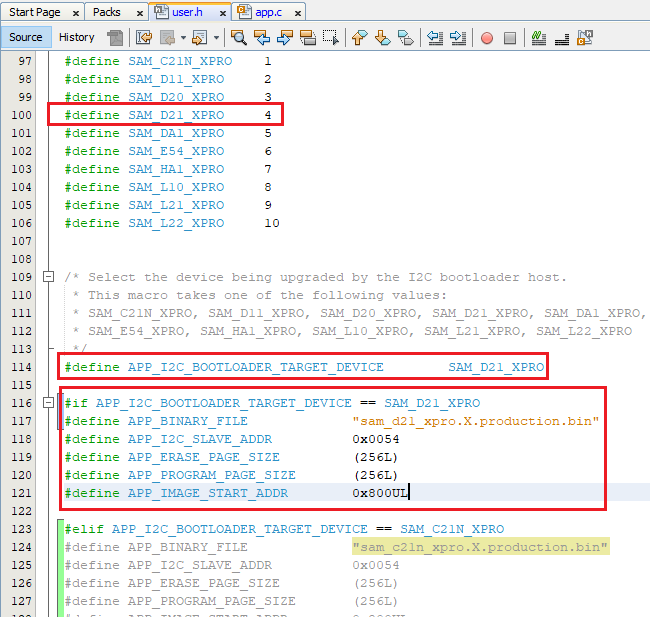

# Configuring the SDCARD Host applications

## Downloading the application

To clone or download this application from Github,go to the [main page of this repository](https://github.com/Microchip-MPLAB-Harmony/bootloader_apps_i2c) and then click Clone button to clone this repo or download as zip file. This content can also be download using content manager by following [these instructions](https://github.com/Microchip-MPLAB-Harmony/contentmanager/wiki)

Path of the SDCARD host applications within the repository is **apps/i2c_bootloader/**

## Configuring the SDCARD Host application

### Follow below steps only when Host development kit is different than Target Development Kit

1. Open the host_app_sdcard/firmware/*.X project in MPLABX IDE

2. Open the "user.h" file as shown below:

    

3. In the "user.h" file specify the Bootloader Target Device used using the predefined macros
       #define APP_I2C_BOOTLOADER_TARGET_DEVICE     SAM_D21_XPRO

    

4. Navigate to the **#if block** for the specified **Bootloader Target Device** and verify the below settings are as expected.

    - **APP_BINARY_FILE:** Name of the Application binary copied to the SDCARD
    - **APP_I2C_SLAVE_ADDR:** I2C slave address
    - **APP_ERASE_PAGE_SIZE:** Erase page size of the target (target = MCU being programmed)
    - **APP_PROGRAM_PAGE_SIZE:** Program page size of the target (target = MCU being programmed).
        - The macro can either be set to the program page size or can be set to the size of the erase page size of the target.
        - In the demo example, the macro is set equal to the size of the erase page.
        - On embedded host where RAM is limited, the macro may be set to the actual program page size to reduce the RAM used to hold the program data.
            - For example, for SAM D20, the macro can be set either to 64 (program page size) or 256 (erase page size)
    - **APP_IMAGE_START_ADDR:** User application start address (This value should be same as the application start address specified in Application Configurations steps).
        - If the bootloader itself is being upgraded then the APP_IMAGE_START_ADDR must be set to 0x00 (start of bootloader)
        - Ensure that the bootloader and application are also configured with the same value of user application start address

### Follow below steps only when multiple Target development kit are to be programmed using the same Host development kit

1. Open the host application source file

2. The **APP_BL_NUM_I2C_SLAVES** must be set equal to the number of slaves being programmed on the I2C bus

3. Specify the following details in the **firmwareUpdateInfo data structure** for other slaves on the bus:

    

    - **i2cSlaveAddr:** Specify the I2C slave address
    - **erasePageSize:** Specify the erase page size of the target (target = MCU being programmed)
    - **programPageSize:** Specify the program page size of the target (target = MCU being programmed).
        - It can either be set to the program page size or can be set to the size of the erase page size of the target.
        - In the demo example, it is set equal to the size of the erase page.
        - On embedded host where RAM is limited, it may be set to the actual program page size to reduce the RAM used to hold the program data.
            - For example, for SAM D20, the programPageSize can be set either to 64 (program page size) or 256 (erase page size).
    - **appStartAddr:** Specify the user application start address (This value should be same as the application start address specified in Application configuration).
        - If the bootloader itself is being upgraded then the appStartAddr must be set to 0x00 (start of the bootloader).
        - Also, ensure that the bootloader is also configured with the same value of application start address.
    - **filename:** Specify the filename of the application binary
