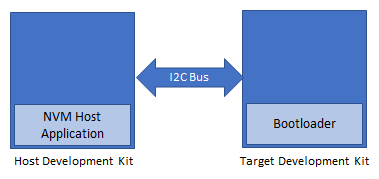

# Building and Running the I2C Bootloader applications

## Downloading and building the application

To clone or download this application from Github,go to the [main page of this repository](https://github.com/Microchip-MPLAB-Harmony/bootloader_apps_i2c) and then click Clone button to clone this repo or download as zip file. This content can also be download using content manager by following [these instructions](https://github.com/Microchip-MPLAB-Harmony/contentmanager/wiki)

Path of the application within the repository is **apps/i2c_bootloader/**

To build the application, refer to the following table and open the project using its IDE.

### Bootloader Application

| Project Name      | Description                                    |
| ----------------- | ---------------------------------------------- |
| bootloader/firmware/sam_d21_xpro.X    | MPLABX Project for [SAM D21 Xplained Pro Evaluation Kit](https://www.microchip.com/developmenttools/ProductDetails/atsamd21-xpro)|

### Test Application

| Project Name      | Description                                    |
| ----------------- | ---------------------------------------------- |
| test_app/firmware/sam_d21_xpro.X    | MPLABX Project for [SAM D21 Xplained Pro Evaluation Kit](https://www.microchip.com/developmenttools/ProductDetails/atsamd21-xpro)|

## Setting up [SAM D21 Xplained Pro Evaluation Kit](https://www.microchip.com/developmenttools/ProductDetails/atsamd21-xpro)

- [SAM D21 Xplained Pro Evaluation Kit](https://www.microchip.com/developmenttools/ProductDetails/atsamd21-xpro) is used for both **Host Development kit** and **Target Development kit**

    

- Connect the I2C SDA line Pin 11 (SERCOM2 PAD[0]/PA08) on EXT1 of the **Host development kit** to the I2C SDA line Pin 11 (SERCOM2 PAD[0]/PA08) on EXT1 of the **Target development kit**
- Connect the I2C SCL line Pin 12 (SERCOM2 PAD[1]/PA09) on EXT1 of the **Host development kit** to the I2C SCL line Pin 12 (SERCOM2 PAD[1]/PA09) on EXT1 of the **Target development kit**
- Connect a ground wire between the Host development kit and Target development kit
- Connect the Debug USB port on the Host development kit to the computer using a micro USB cable
- Connect the Debug USB port on the Target development kit to the computer using a micro USB cable

## Building and Configuring I2C Host Applications

### Using I2C NVM Host application to send the application binary to Target development kit

If the NVM Host Development Kit being used is other than [SAM D21 Xplained Pro Evaluation Kit](https://www.microchip.com/developmenttools/ProductDetails/atsamd21-xpro) then follow the steps mentioned in [Configuring NVM Host application project](../../docs/readme_configure_host_app_nvm.md#configuring-the-nvm-host-application)

1. Open the NVM host application project *host_app_nvm/firmware/sam_d21_xpro.X* in the IDE
    - If a NVM host application project of different development kit is used then open that project in the IDE

2. Build and program the NVM host application using the IDE on to the Host development kit
    - The prebuilt test application image available under **host_app_nvm/firmware/src/test_app_images/image_pattern_hex_sam_d21_xpro.h** will be programmed on to the Target development kit with default **host_app_nvm** project configuration

3. Jump to [Running The Application](#running-the-application)

### **Using I2C SDCARD Host application to send the application binary to Target development kit**

If the SDCARD Host Development Kit being used is other than [SAM D21 Xplained Pro Evaluation Kit](https://www.microchip.com/developmenttools/ProductDetails/atsamd21-xpro) then follow the steps mentioned in [Configuring SDCARD Host application project](../../docs/readme_configure_host_app_sdcard.md#configuring-the-sdcard-host-application)

1. Connect [IO1 Xplained Pro Extension Kit](https://www.microchip.com/developmenttools/ProductDetails/ATIO1-XPRO) to the EXT1 header of [SAM D21 Xplained Pro Evaluation Kit](https://www.microchip.com/developmenttools/ProductDetails/atsamd21-xpro) 

2. Open the SDCARD host application project *host_app_sdcard/firmware/sam_d21_xpro.X* in the IDE
    - If a SDCARD host application project of different development kit is used then open that project in the IDE
2. Build and program the SDCARD host application using the IDE on to the I2C host dvelopment kit

3. Open the test application project *test_app/firmware/sam_d21_xpro.X* in the IDE
4. Build the project to generate the binary **(Do not program the binary)**

5. Copy the application binary into the SD card and insert the SD card in the SD card slot available on the [IO1 Xplained Pro Extension Kit](https://www.microchip.com/developmenttools/ProductDetails/ATIO1-XPRO)

6. Open the Terminal application (Ex.:Tera Term) on the computer
7. Configure the serial port settings for **Host Development kit** as follows:
    - Baud : 115200
    - Data : 8 Bits
    - Parity : None
    - Stop : 1 Bit
    - Flow Control : None

8. Jump to [Running The Application](#running-the-application)

## Running the Application

1. Open the bootloader project *bootloader/firmware/sam_d21_xpro.X* in the IDE
2. Build and program the application using the IDE on to the **Target development kit**
    - **LED0** will be turned-on to indicate that bootloader code is running on the target
    - **LED0** will also turn on when the bootloader does not find a valid application; i.e. the first word of the application (stack pointer), contains 0xFFFFFFFF

3. **If the test application is being programmed**, Open the Terminal application (Ex.:Tera Term) on the computer and configure the serial port settings for **Target Development kit** as follows:
    - Baud : 115200
    - Data : 8 Bits
    - Parity : None
    - Stop : 1 Bit
    - Flow Control : None

4. Press the Switch **SW0** on the Host development kit to trigger programming of the application binary
5. Once the programming is complete,
    - **LED0** on the Host development kit will be turned on indicating success

    - If **SDCARD Host application** was used to program the application binary following message will be displayed on the terminal of **Host development kit**

        

    - The target development kit will be reset. Upon re-start, the boot-loader will jump to the user application

    - If the test application is programmed then **LED0** should start blinking and you should see below output on the **Target development kit** console

        

6. Press and hold the Switch **SW0** to trigger Bootloader from test application and you should see below output

    

7. Press Reset button on the Host development kit to reprogram the application binary
8. Repeat Steps 4-5 once
    - This step is to verify that bootloader is running after triggering bootloader from test application in Step 6

## Additional Steps (Optional)

### Using I2C NVM Host application

- To bootload any application other than **host_app_nvm/firmware/src/test_app_images/image_pattern_hex_sam_d21_xpro.h** refer to [Application Configurations](../../docs/readme_configure_application_sam.md)

- Once the application is configured, Refer to [Configuring NVM Host application project](../../docs/readme_configure_host_app_nvm.md) for setting up the **host_app_nvm** project

- Once done repeat the applicable steps mentioned in [Running The Application](#running-the-application)

### Using SDCARD Host application

- If multiple Target development kit are to be programmed using the same Host development kit then refer to [Configuring SDCARD Host application project](../../docs/readme_configure_host_app_sdcard.md)

- Once done repeat the applicable steps mentioned in [Running The Application](#running-the-application)
