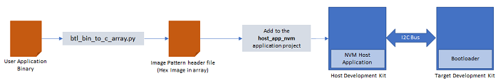

To clone or download this application from Github,go to the [main page of this repository](https://github.com/Microchip-MPLAB-Harmony/bootloader_apps_i2c) and then click Clone button to clone this repo or download as zip file. This content can also be download using content manager by following [these instructions](https://github.com/Microchip-MPLAB-Harmony/contentmanager/wiki)

# I2C Bootloader

This example application shows how to use the Bootloader Library to bootload an application using I2C protocol.

### Bootloader Application

- This is a bootloader application which resides from starting location of the device flash memory
- It uses I2C peripheral library in non-interrupt mode
- Trigger Methods
    - It uses the On board Switch as bootloader trigger pin to force enter the bootloader at reset of device
    - It checks for bootloader request pattern **(0x5048434D)** from the starting 16 Bytes of RAM to force enter bootloader at reset of device

### NVM Host Application

- This is a embedded I2C host application which sends the application image stored in it's internal flash (NVM) to the target board over the I2C bus
- The user application binary must be converted to a header file containing the application image in HEX format in a C style array. A [btl_bin_to_c_array.py](../../tools/docs/readme_btl_bin_to_c_array.md) utility is provided to do this conversion

    

- Add the generated application image header file to the NVM host application project. Rebuild and program the NVM host application. This results in the application image being copied in the host MCU's flash (NVM)

### SDCARD Host Application
- This is a embedded I2C host application which sends the application image stored in the SD card to the target board over the I2C bus
- The user application binary is copied into an SD card and inserted in the SD card connected on the host board

    

### Test Application

- This is a test application which resides from end of bootloader size in device flash memory
- It will be loaded into flash memory by bootloader application
- It blinks an LED and provides console output
- It uses the On board Switch to trigger the bootloader from firmware **(May not be supported on all devices)**
    - Once the switch is pressed it loads first 16 bytes of RAM with bootloader request pattern **(0x5048434D)** and resets the device

## Development Kits
The following table provides links to documentation on how to build and run I2C bootloader on different development kits

| Development Kit |
|:---------|
|[PIC32CM MC00 Curiosity Pro Evaluation Kit](docs/readme_pic32cm_mc00_curiosity_pro.md) |
|[PIC32MK MCA Curiosity Pro](docs/readme_pic32mk_mca_curiosity_pro.md) |
|[PIC32MM USB Curiosity Development Board](docs/readme_pic32mm_usb_curiosity.md)|
|[SAM C21N Xplained Pro Evaluation Kit](docs/readme_sam_c21n_xpro.md) |
|[SAM D11 Xplained Pro Evaluation Kit](docs/readme_sam_d11_xpro.md) |
|[SAM D20 Xplained Pro Evaluation Kit](docs/readme_sam_d20_xpro.md) |
|[SAM D21 Xplained Pro Evaluation Kit](docs/readme_sam_d21_xpro.md) |
|[SAM DA1 Xplained Pro Evaluation Kit](docs/readme_sam_da1_xpro.md) |
|[SAM E54 Xplained Pro Evaluation Kit](docs/readme_sam_e54_xpro.md) |
|[SAM HA1G16A Xplained Pro](docs/readme_sam_ha1_xpro.md) |
|[SAM L10 Xplained Pro Evaluation Kit](docs/readme_sam_l10_xpro.md) |
|[SAM L21 Xplained Pro Evaluation Kit](docs/readme_sam_l21_xpro.md) |
|[SAM L22 Xplained Pro Evaluation Kit](docs/readme_sam_l22_xpro.md) |
|[SAM E70 Xplained Ultra Evaluation Kit](docs/readme_sam_e70_xult.md) |
