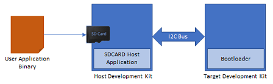

# I2C Bootloader

This example application shows how to use the Bootloader Library to bootload an application using I2C protocol.

**Bootloader Application**

-   This is a bootloader application which resides from starting location of the device flash memory

-   It uses I2C peripheral library in non-interrupt mode

-   Trigger Methods

    -   It uses the On board Switch as bootloader trigger pin to force enter the bootloader at reset of device

    -   It checks for bootloader request pattern **\(0x5048434D\)** from the starting 16 Bytes of RAM to force enter bootloader at reset of device

**NVM Host Application**

-   This is a embedded I2C host application which sends the application image stored in it's internal flash \(NVM\) to the target board over the I2C bus

-   The user application binary must be converted to a header file containing the application image in HEX format in a C style array. A [btl\_bin\_to\_c\_array.py](../../docs/GUID-9CAF1352-B47D-4AD7-B254-E4195891E669.md) utility is provided to do this conversion

    

-   Add the generated application image header file to the NVM host application project. Rebuild and program the NVM host application. This results in the application image being copied in the host MCU's flash \(NVM\)

**SDCARD Host Application**

-   This is a embedded I2C host application which sends the application image stored in the SD card to the target board over the I2C bus

-   The user application binary is copied into an SD card and inserted in the SD card connected on the host board

    

**Test Application**

-   This is a test application which resides from end of bootloader size in device flash memory

-   It will be loaded into flash memory by bootloader application

-   It blinks an LED and provides console output

-   It uses the On board Switch to trigger the bootloader from firmware **\(May not be supported on all devices\)**

    -   Once the switch is pressed it loads first 16 bytes of RAM with bootloader request pattern **\(0x5048434D\)** and resets the device

**Development Kits** The following table provides links to documentation on how to build and run I2C bootloader on different development kits

-   **[PIC32CM MC00 Curiosity Pro Evaluation Kit: Building and Running the I2C Bootloader applications](../../docs/GUID-D4179FE5-AFC5-4308-8D73-CEFD94BE2571.md)**  

-   **[PIC32CZ CA80 Curiosity Ultra Development Board: Building and Running the I2C Bootloader applications](../../docs/GUID-DB7059E5-D0F7-48DB-8892-E0809B00C8F8.md)**  

-   **[PIC32MK MCA Curiosity Pro: Building and Running the I2C Bootloader applications](../../docs/GUID-9A44E1A4-3100-4C23-9A2A-BB377C0D1D25.md)**  

-   **[PIC32MK MCJ Curiosity Pro: Building and Running the I2C Bootloader applications](../../docs/GUID-EECFECB0-BC12-4251-AB38-D94F24BCBB1A.md)**  

-   **[PIC32MM USB Curiosity Development Board: Building and Running the I2C Bootloader applications](../../docs/GUID-356E7BC2-DD74-4AB0-9E4B-763F99DC1188.md)**  

-   **[SAM C21N Xplained Pro Evaluation Kit: Building and Running the I2C Bootloader applications](../../docs/GUID-D5880DBF-4A78-4FC6-8465-07209E9EAEB0.md)**  

-   **[SAM D11 Xplained Pro Evaluation Kit: Building and Running the I2C Bootloader applications](../../docs/GUID-331E3623-B88E-440C-82F1-D30A5CDEE426.md)**  

-   **[SAM D20 Xplained Pro Evaluation Kit: Building and Running the I2C Bootloader applications](../../docs/GUID-8C8A0A1A-C5E6-4562-AFFE-325DB1699629.md)**  

-   **[SAM D21 Xplained Pro Evaluation Kit: Building and Running the I2C Bootloader applications](../../docs/GUID-54382171-F7F5-409A-89D6-4798E2AA43AE.md)**  

-   **[SAM DA1 Xplained Pro Evaluation Kit: Building and Running the I2C Bootloader applications](../../docs/GUID-C276A55B-8AC3-4B36-A26D-F2A37BD1885D.md)**  

-   **[SAM E54 Xplained Pro Evaluation Kit: Building and Running the I2C Bootloader applications](../../docs/GUID-150E2CB4-559E-4485-AAEF-6677A7D69781.md)**  

-   **[SAM E70 Xplained Ultra Evaluation Kit: Building and Running the TWI Bootloader applications](../../docs/GUID-DDDCB31F-D6FC-430F-A46F-EE9B2E74C8CE.md)**  

-   **[SAM HA1G16A Xplained Pro: Building and Running the I2C Bootloader applications](../../docs/GUID-901EDB7B-9526-43B5-B588-204229202782.md)**  

-   **[SAM L10 Xplained Pro Evaluation Kit: Building and Running the I2C Bootloader applications](../../docs/GUID-92C72012-CDBD-447E-90F3-8609E6278DE2.md)**  

-   **[SAM L21 Xplained Pro Evaluation Kit: Building and Running the I2C Bootloader applications](../../docs/GUID-E4FF9A5C-CEE8-4138-8F92-A892A1631EF6.md)**  

-   **[SAM L22 Xplained Pro Evaluation Kit: Building and Running the I2C Bootloader applications](../../docs/GUID-A713CA7D-9DB9-4C8B-8D03-4A50A8FC13D6.md)**  

-   **[PIC32CX-BZ2 and WBZ451 Curiosity Development Board: Building and Running the I2C Bootloader applications](../../docs/GUID-CDFE8722-DE9A-4D08-8E95-2EDCEF11F954.md)**  

**Parent topic:**[MPLAB® Harmony 3 I2C Bootloader Application Examples](../../docs/GUID-85B9ED1C-4EF8-4639-8758-17D68906C3F9.md)

