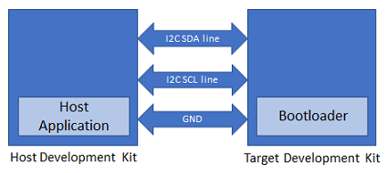

# Building and Running the I2C WLCSP Bootloader applications

## Downloading and building the application

To clone or download this application from Github,go to the [main page of this repository](https://github.com/Microchip-MPLAB-Harmony/bootloader_apps_i2c) and then click Clone button to clone this repo or download as zip file. This content can also be download using content manager by following [these instructions](https://github.com/Microchip-MPLAB-Harmony/contentmanager/wiki)

Path of the application within the repository is **apps/i2c_bootloader_wlcsp/**

To build the application, refer to the following table and open the project using its IDE.

### Bootloader Application

| Project Name                              | Description                       |
| ----------------------------------------- | --------------------------------- |
| bootloader/firmware/samd20e16bu_wlcsp.X   | MPLABX Project for SAMD20E16BU    |

## Setting up SAMD20E16BU

- [SAM E54 Xplained Pro Evaluation Kit](https://www.microchip.com/developmenttools/ProductDetails/atsame54-xpro) is used for the **Host Development kit** and SAMD20E16BU is used as the target

    

- Connect the I2C SDA line (SERCOM7 PAD[0]/PD08) of the **Host development kit** to the I2C SDA line (SERCOM2 PAD[0]/PA08) of the target
- Connect the I2C SCL line (SERCOM7 PAD[1]/PD09) of the **Host development kit** to the I2C SCL line (SERCOM2 PAD[1]/PA09) of the target
- Connect a ground wire between the Host development kit and target
- Connect the Debug USB port on the Host development kit to the computer using a micro USB cable
- Power up the target board

## Building and Configuring I2C Host Applications

### Using I2C SDCARD Host application to send the application binary to Target development kit

1. Open the application project to be programmed on target, in the IDE
2. To configure the application refer to [Application Configurations](../../docs/readme_configure_application_sam.md)
3. Build the project to generate the binary **(Do not program the binary)**

4. Open the SDCARD host application project *host_app_sdcard/firmware/sam_e54_xpro.X* in the IDE
5. Build and program the SDCARD host application using the IDE on to the **host dvelopment kit**

6. Copy the application binary into the SD card and rename it to **image.bin**
7. Insert the SD card in the SD card slot

8. Open the Terminal application (Ex.:Tera Term) on the computer
9. Configure the serial port settings for **Host Development kit** as follows:
    - Baud : 115200
    - Data : 8 Bits
    - Parity : None
    - Stop : 1 Bit
    - Flow Control : None

10. Jump to [Running The Application](#running-the-application)

## Running the Application

1. Open the bootloader project *bootloader/firmware/samd20e16bu_wlcsp.X* in the IDE
2. Build and program the application using the IDE on to the **Target development kit**
3. Press the Switch **SW0** on the **Host development kit** to trigger programming of the application binary
4. Once the programming is complete,
    - **LED0** on the Host development kit will be turned on indicating success

    - The target development kit will be reset. Upon re-start, the boot-loader will jump to the user application

## Additional Steps (Optional)

### Using SDCARD Host application

- If multiple Target devices are to be programmed using the same Host development kit then refer to [Configuring SDCARD Host application project](../../docs/readme_configure_host_app_sdcard.md)

- Once done repeat the applicable steps mentioned in [Running The Application](#running-the-application)
