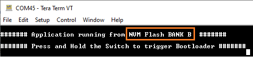
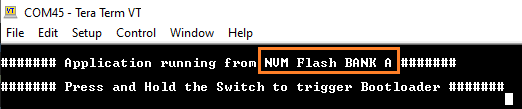
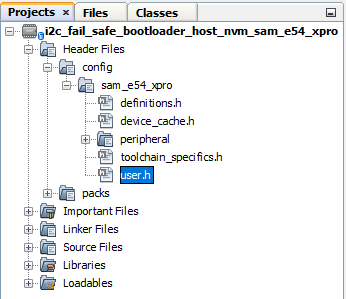
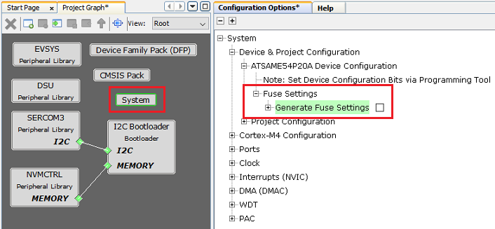

[](https://www.microchip.com)

# Building and Running the I2C Fail Safe Bootloader applications

## Downloading and building the application

To clone or download this application from Github,go to the [main page of this repository](https://github.com/Microchip-MPLAB-Harmony/bootloader_apps_i2c) and then click Clone button to clone this repo or download as zip file. This content can also be download using content manager by following [these instructions](https://github.com/Microchip-MPLAB-Harmony/contentmanager/wiki)

Path of the application within the repository is **apps/i2c_fail_safe_bootloader/**

To build the application, refer to the following table and open the project using its IDE.

### Bootloader Application

| Project Name      | Description                                    |
| ----------------- | ---------------------------------------------- |
| bootloader/firmware/sam_e54_xpro.X    | MPLABX Project for [SAM E54 Xplained Pro Evaluation Kit](https://www.microchip.com/developmenttools/ProductDetails/atsame54-xpro)|


### Test Application

| Project Name      | Description                                    |
| ----------------- | ---------------------------------------------- |
| test_app/firmware/sam_e54_xpro.X    | MPLABX Project for [SAM E54 Xplained Pro Evaluation Kit](https://www.microchip.com/developmenttools/ProductDetails/atsame54-xpro)|


## Setting up [SAM E54 Xplained Pro Evaluation Kit](https://www.microchip.com/developmenttools/ProductDetails/atsame54-xpro)

- [SAM E54 Xplained Pro Evaluation Kit](https://www.microchip.com/developmenttools/ProductDetails/atsame54-xpro) is used for both **Host Development kit** and **Target Development kit**

    

- Connect the I2C SDA line Pin 11 (SERCOM7 PAD[0]/PD08) on EXT3 of the **Host development kit** to the I2C SDA line Pin 11 (SERCOM3 PAD[0]/PA22) on EXT1 of the **Target development kit**
- Connect the I2C SCL line Pin 12 (SERCOM3 PAD[1]/PA23) on EXT3 of the **Host development kit** to the I2C SCL line Pin 12 (SERCOM3 PAD[1]/PA23) on EXT1 of the **Target development kit**
- Connect a ground wire between the Host development kit and Target development kit
- Connect the Debug USB port on the Host development kit to the computer using a micro USB cable
- Connect the Debug USB port on the Target development kit to the computer using a micro USB cable

## Running the Application

1. Open the bootloader project *bootloader/firmware/sam_e54_xpro.X* in the IDE
2. Build and program the application using the IDE on to the **Target development kit**
    - **LED0** will be turned-on to indicate that bootloader code is running on the target
    - **LED0** will also turn on when the bootloader does not find a valid application; i.e. the first word of the application (stack pointer), contains 0xFFFFFFFF

3. Open the NVM host application project *host_app_nvm/firmware/sam_e54_xpro.X* in the IDE

4. Build and program the NVM host application using the IDE on to the Host development kit
    - The prebuilt combined bootloader and application HEX header file **host_app_nvm/firmware/src/test_app_images/image_pattern_hex_sam_e54_xpro_bootloader_app_merged.h** will be programmed to the **Target Development kit**

    - This must be programmed once to program both bootloader and application into the inactive flash bank

5. Open the Terminal application (Ex.:Tera Term) on the computer
6. Configure the serial port settings for **Target Development kit** as follows:
    - Baud : 115200
    - Data : 8 Bits
    - Parity : None
    - Stop : 1 Bit
    - Flow Control : None

7. Press the Switch **SW0** on the Host development kit to trigger programming of the binary
8. Once the programming is complete,
    - **LED0** on the **Host development kit** will be turned on indicating success

    - **LED0** on the **Target development kit** should start blinking and you should see below output on the console
        - The NVM Flash Bank Can be **BANK A** or **BANK B** based on from where the test application is running

    

    

9. Press and hold the Switch **SW0** on the **Target development kit** to trigger Bootloader from test application
    - This is to program the application binary in other bank and you should see below output

    

10. To program the prebuilt application image **host_app_nvm/firmware/src/test_app_images/image_pattern_hex_sam_e54_xpro.h** to the inactive bank of **Target Development kit**, Open the "user.h" file of the NVM host application project *host_app_nvm/firmware/sam_e54_xpro.X* as shown below:

    

11. In the "user.h" file update the **APP_HEX_HEADER_FILE** and **APP_IMAGE_START_ADDR** values as mentioned below

    ```
    #define APP_HEX_HEADER_FILE         "test_app_images/image_pattern_hex_sam_e54_xpro.h"

    #define APP_IMAGE_START_ADDR        0x82000UL
    ```

    

    - **APP_HEX_HEADER_FILE:** Relative path to the generated header file containing the application hex image in an array
    - **APP_I2C_SLAVE_ADDR:** I2C slave address
    - **APP_ERASE_PAGE_SIZE:** Erase page size of the target (target = MCU being programmed)
    - **APP_PROGRAM_PAGE_SIZE:** Program page size of the target (target = MCU being programmed).
        - The macro can either be set to the program page size or can be set to the size of the erase page size of the target.
        - In the demo example, the macro is set equal to the size of the erase page.
        - On embedded host where RAM is limited, the macro may be set to the actual program page size to reduce the RAM used to hold the program data.
    - **APP_IMAGE_START_ADDR:** User application start address
        - It must be set to **0x80000UL** when programming the **combined bootloader and application binary** to the inactive bank
        - It must be set to **0x82000UL** when programming the **application binary** only to the inactive bank

12. Build and program the NVM host application using the IDE on to the **Host development kit**

13. On the **Target Development Kit** (the board being programmed), press and hold the Switch **SW0** and then press Reset button or Power cycle to force trigger bootloader at startup
    - **LED0** will be turned-on to indicate that bootloader code is running on the target

14. Press Reset button on the **Host development kit** to program the application binary
15. Repeat Steps 7-8 once
    - You should see other Bank in console displayed compared to first run


## Additional Steps (Optional)

### Generating Hex Image pattern for an application to be bootloaded


1. To bootload any application other than **host_app_nvm/firmware/src/test_app_images/image_pattern_hex_sam_e54_xpro.h** refer to [Application Configurations](../../docs/readme_configure_application_sam.md)

2. Build the application project to generate the binary **(Do not program the binary)**

3. Convert the generated binary (.bin file) to a header file containing the image data in a C style array:
    - On a Windows machine, open the command prompt and run the [btl_bin_to_c_array](../../../tools/docs/readme_btl_bin_to_c_array.md) utility to generate a header file containing the image data in an array

          python <harmony3_path>\bootloader\tools\btl_bin_to_c_array_gen.py -b <binary_file> -o <harmony3_path>\bootloader_apps_i2c\apps\i2c_fail_safe_bootloader\host_app_nvm\firmware\src\test_app_images\image_pattern_hex_sam_e54_xpro.h -d same5x

4. Once done repeat the applicable steps mentioned in [Running The Application](#running-the-application)

### Generating Hex Image pattern for Commbined Bootloader and Application Binary


1. Launch MHC for the bootloader project *bootloader/firmware/sam_e54_xpro.X*
2. Select **system** component from the project graph and disable fuse settings

3. **Disable Fuse Settings:**
    - Fuse settings needs to be disabled for the bootloader which will be boot-loaded as the fuse settings are supposed to be programmed through programming tool
    - Also the fuse settings are not programmable through firmware
    - Enabling the fuse settings also increases the size of the binary when generated through the hex file

    

4. Regenrate the project

5. Specifing post build option to automatically generate the binary file from hex file once the build is complete

        ${MP_CC_DIR}/xc32-objcopy -I ihex -O binary ${DISTDIR}/${PROJECTNAME}.${IMAGE_TYPE}.hex ${DISTDIR}/${PROJECTNAME}.${IMAGE_TYPE}.bin

    

6. Build the bootloader project to generate the bootloader binary **(Do not program the binary)**

7. Build the sample application test_app (or any other application configured to bootload) using IDE to generate the application binary **(Do not program the binary)**

8. On a Windows machine, open the command prompt

9. Run the [btl_app_merge_bin.py](../../../tools/docs/readme_btl_app_merge_bin.md) utiliy from command prompt to merge the generated Bootloader binary and test application binary. Below output should be displayed on command prompt

        python <harmony3_path>\bootloader\tools\btl_app_merge_bin.py -o 0x2000 -b <harmony3_path>\bootloader_apps_i2c\apps\i2c_fail_safe_bootloader\bootloader\firmware\sam_e54_xpro.X\dist\sam_e54_xpro\production\sam_e54_xpro.X.production.bin -a <harmony3_path>\bootloader_apps_i2c\apps\i2c_fail_safe_bootloader\test_app\firmware\sam_e54_xpro.X\dist\sam_e54_xpro\production\sam_e54_xpro.X.production.bin

    

10. Run [btl_bin_to_c_array](../../../tools/docs/readme_btl_bin_to_c_array.md) utility to convert the generated merged binary **btl_app_merged.bin** to a header file containing the image data in a C style array
    - The merged binary will be created in the directory from where the script was called

          python <harmony3_path>\bootloader\tools\btl_bin_to_c_array.py -b <Path_to_merged_binary>\btl_app_merged.bin -o <harmony3_path>\bootloader_apps_i2c\apps\i2c_fail_safe_bootloader\host_app_nvm\firmware\src\test_app_images\image_pattern_hex_sam_e54_xpro_bootloader_app_merged.h -d same5x

11. Once done repeat the applicable steps mentioned in [Running The Application](#running-the-application)
