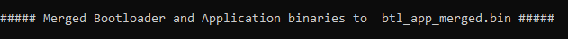

# Bootloader and Application binary merge script Help

This document describes the usage of **btl\_app\_merge\_bin.py** host script

Path of the tool in bootloader repository is **tools/btl\_app\_merge\_bin.py**

**Setting up the Host PC**

-   The Script is compatible with **Python 3.x** and higher


**Description**

-   This script should be used to merge the bootloader binary and application binary

-   It creates a merged binary output where bootloader is placed from start and the application will be placed at the offset passed as parameter

-   If the application offset is not equal to end of bootloader offset it fills the gap with 0xFF until the application offset

-   The merged binary can be used by **I2C NVM Host Application** as input for Updating bootloader and application together

-   The merged binary will be created in the directory from where the script was called


**Usage Examples**

Below is the syntax to show help menu for the script

```
python <harmony3_path>/bootloader/tools/btl_app_merge_bin.py --help
```


**Below is the syntax and an example on how to merge a bootloader binary and application binary**

```
python <harmony3_path>/bootloader/tools/btl_app_merge_bin.py -o <Offset> -b <Bootloader_binary_path> -a <Application_binary_path>
```

```c
python <harmony3_path>/bootloader/tools/btl_app_merge_bin.py -o 0x2000 -b <harmony3_path>/bootloader_apps_i2c/apps/i2c_fail_safe_bootloader/bootloader/firmware/sam_e54_xpro.X/dist/sam_e54_xpro/production/sam_e54_xpro.X.production.bin -a <harmony3_path>/bootloader_apps_i2c/apps/i2c_fail_safe_bootloader/test_app/firmware/sam_e54_xpro.X/dist/sam_e54_xpro/production/sam_e54_xpro.X.production.bin
```



**Parent topic:**[I2C Bootloader Tools Help](GUID-B4EA58EE-B62B-4DEC-BA99-85FCEC62040F.md)

