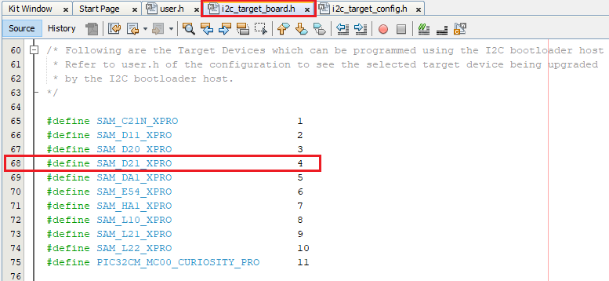

# Configuring the NVM Host applications

Path of the NVM host applications within the repository are

-   **apps/i2c\_bootloader/**

-   **apps/i2c\_fail\_safe\_bootloader/**

-   **apps/i2c\_bootloader\_wlcsp/**


**Generating Hex Image pattern used by NVM Host application**

**Follow below steps only when existing test\_app is rebuilt or any other application is to be bootloaded**

1.  Open the application project to be bootloaded in the IDE

    -   If existing test application has to be built open test\_app/firmware/\*.X

2.  Build the application project to generate the binary **\(Do not program the binary\)**

3.  Convert the generated binary \(.bin file\) to a header file containing the image data in a C style array:

    -   On a Windows machine, open the command prompt and launch the **btl\_bin\_to\_c\_array.py** utility to generate a header file containing the image data in an array

        ```
        python <harmony3_path>/bootloader/tools/btl_bin_to_c_array.py -b <binary_file> -o <hex_file> -d <device>
        ```

    -   Refer to [btl\_bin\_to\_c\_array utility](GUID-9CAF1352-B47D-4AD7-B254-E4195891E669.md) for converting the binary to C array in hex format

        

4.  Add the application hex header file generated in above step to the test app images path of the I2C embedded host application **host\_app\_nvm/firmware/src/test\_app\_images/**

    -   **Example:**

        -   If the application hex header file generated is for **sam\_d21\_xpro.X** project, Name it as **image\_pattern\_hex\_sam\_d21\_xpro.h** and place it in above path


**Configuring the NVM Host application**

**Follow below steps only when Host development kit is different than Target Development Kit**

1.  Open the host\_app\_nvm/firmware/\*.X project in MPLABX IDE

2.  Open the "user.h" file as shown below:

    

3.  Open **test\_app\_images/i2c\_target\_boards.h** to get predefined macros of supported Bootloader Target Devices

    

4.  In the "user.h" file specify the Bootloader Target Device used using the predefined macros from **test\_app\_images/i2c\_target\_boards.h**

    ```
    #define APP_I2C_BOOTLOADER_TARGET_DEVICE     SAM_D21_XPRO
    ```

    

5.  Open **test\_app\_images/i2c\_target\_config.h** to get predefined configuration of supported Bootloader Target Devices

6.  Navigate to the **\#if block** for the specified **Bootloader Target Device** and verify the below settings are as expected.

    

    -   **APP\_HEX\_HEADER\_FILE:** Relative path to the generated header file containing the application hex image in an array

    -   **APP\_I2C\_SLAVE\_ADDR:** I2C slave address

    -   **APP\_ERASE\_PAGE\_SIZE:** Erase page size of the target \(target = MCU being programmed\)

    -   **APP\_PROGRAM\_PAGE\_SIZE:** Program page size of the target \(target = MCU being programmed\).

        -   The macro can either be set to the program page size or can be set to the size of the erase page size of the target.

        -   In the demo example, the macro is set equal to the size of the erase page.

        -   On embedded host where RAM is limited, the macro may be set to the actual program page size to reduce the RAM used to hold the program data.

            -   For example, for SAM D20, the macro can be set either to 64 \(program page size\) or 256 \(erase page size\)

    -   **APP\_IMAGE\_START\_ADDR:** User application start address \(This value should be same as the application start address specified in Application Configurations steps\).

        -   If the bootloader itself is being upgraded then the APP\_IMAGE\_START\_ADDR must be set to 0x00 \(start of bootloader\)

        -   Ensure that the bootloader and application are also configured with the same value of user application start address


**Parent topic:**[Configuring a Host Application used to send an application binary to bootloader](GUID-15406252-9218-49AD-A903-7F7144DCA8FC.md)

